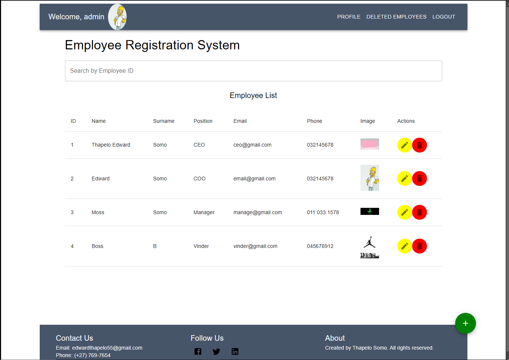

## Employee-Registrstion
- This application was made to keep track of employees in a company
- It utilises local Storage to keep track of the employees 

## LogIn Credentials

    username: 'admin@gmail.com',
    password: '123456',

    #These can be edited on runtime, But if reseted it will start Over from Default

## Installation
- npm install @mui/material @emotion/react @emotion/styled @mui/icons-material react-router-dom
## Run 
- npm run dev
## Requirements
## Search Function:
- Users can search for employees by ID.
## Add Function:
- Users can add a new employee with the following details:
- Name
- Email Address
- Phone Number
- Image
- Position
- ID
## Delete Function: 
- Users can delete existing employees.
## Update Function: 
- Users can edit existing employee details.
##Local Storage:
- Use arrays to store the list of employees in local storage.
- View existing employees.
- View employees who left the organisations.
## General Requirements for Both Applications:
- Implemented CRUD (Create, Read, Update, Delete) operations for bookmarks/employees.
- The app is responsive.
Provide a sketch or mockup using any platform you are comfortable with, such as Figma, free-hand on paper, etc.
